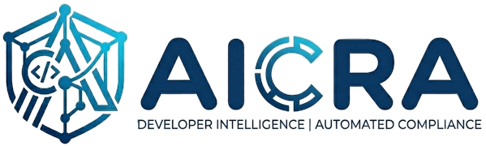

# AICRA (AI Code Review and Automation)

<p align="center">
  
</p>

AICRA is an advanced developer intelligence dashboard and automated compliance pipeline that orchestrates **AI-Assisted Code Reviews**, **Engineering Return on Investment (ROI) Auditing**, and **Functional Design Specification (FDS) Gap Analysis**. 

Designed for modern engineering leadership and development teams, AICRA connects your actual development activity (Git commits, file structural footprint) with Jira tracking, SonarQube static analysis, and your choice of AI model — **OpenAI GPT-4o**, **Anthropic Claude**, or **Google Gemini** — to ensure complete behavioural and architectural alignment.

---

## Table of Contents
1. [Description](#description)
   - [Core Modules](#core-modules)
   - [Key Technical Innovations](#key-insights--technical-innovations)
2. [Project Architecture & Directory Structure](#project-architecture--directory-structure)
3. [Installation Instructions](#installation-instructions)
   - [Prerequisites](#prerequisites)
   - [Step-by-Step Setup](#step-by-step-setup)
4. [Usage](#usage)
   - [Running the Web Dashboard](#1-running-the-web-dashboard)
   - [Running the CLI Code Review Pipeline](#2-running-the-cli-code-review-pipeline)
   - [Executing FDS Gap Analysis](#3-executing-fds-gap-analysis)
   - [Viewing Engineering ROI & Unlinked Work](#4-viewing-engineering-roi--unlinked-work)
5. [Contributing](#contributing)
6. [License](#license)

---

## Description

AICRA addresses three core challenges in the modern software development lifecycle: ensuring code quality, measuring delivery alignment, and validating functional completeness against specification documents. 

Instead of treating these issues as disconnected developer tasks, AICRA unifies them into a single, high-fidelity developer dashboard and automated reporting framework.

### Core Modules

#### 1. AI Code Review Pipeline (`ReviewRunner`)
Integrates static analysis scans with advanced generative AI to provide a "Deep Code Review" of commits and branches.
* **SonarQube Integration:** Triggers automated scans of target projects, analyzes rules, and extracts code smells, bugs, and coverage metrics.
* **Preprocessed AI Reviews:** Filters high-density static analysis results (respecting `MAX_ISSUES_FOR_AI` thresholds) and feeds them to Gemini.
* **Intelligent Assessments:** Separates true software defects from false positives, detects complex logical bugs, and highlights critical safety/security issues.
* **visual Remediation Plans:** Generates clear text descriptions of standard violations, production impact, correct patch code, and interactive Mermaid diagrams representing structural code flows.

#### 2. Engineering Intelligence & ROI Auditor (`ROIAuditor`)
Cross-references real codebase structural footprint changes with Jira project tracking.
* **Delivery Metrics:** Automatically classifies completed developer tasks into **Features**, **Bugs**, **Technical Debt**, or **Research** based on Jira issues and commit characteristics.
* **Structural Footprint Analysis:** Integrates `cloc` (Count Lines of Code) and `git-sizer` to analyze the exact density and risk profiles of modifications.
* **Unlinked Work Report:** Solves visibility gaps by tracking commits that have no linked Jira tickets, classifying them as either "Routine" (bots, dependency updates, simple format fixes) or "Potential Feature Work" (actual shadow development).
* **Alert Fatigue Mitigation:** Implements a localized **Risk Dismissal** system. Team leads can dismiss active risk alerts (e.g., large code changes without test coverage) by supplying a mandatory explanation, keeping dashboards focused on actionable items.

#### 3. Functional Design Specification (FDS) Gap Analyzer (`FDSAnalyzer`)
An advanced requirements auditor that matches functional specifications against actual implemented codebases.
* **PageIndex (Hierarchical Structural Indexing):** Solves the LLM "context window loss" problem. It builds a local index of structural code symbols (classes, methods, routes) to feed targeted context to the AI in batches.
* **Requirements Parser:** Extracts structured IDs (e.g., `FDS-REQ-44`) and descriptions directly from plaintext or PDF specification manuals.
* **The Confidence Paradox Solution:** Separates **Implementation Status** (`VERIFIED`, `PARTIAL`, `NOT_IMPLEMENTED`) from **Assessment Confidence** (the AI's certainty level). A requirement marked as `NOT_IMPLEMENTED` with `100% Confidence` means the system is absolutely sure the feature is missing, providing high-fidelity, actionable gap reports.

---

### Key Insights & Technical Innovations

| Technical Feature | Purpose | How it works |
| :--- | :--- | :--- |
| **PageIndex** | Bypass LLM context limitations | Local parser indexes structural signatures of methods/classes, allowing the analyzer to feed precise files in small batches to the AI model. |
| **Risk Dismissal** | Prevent alert fatigue | Generates a unique risk hash based on code patterns; team leads can dismiss alerts with an audit log reason. |
| **Unlinked Work Analysis** | Track shadow development | Parses Git commit histories for Jira issue patterns and automatically classifies unlinked commits by author, file size, and message patterns. |
| **Circuit Breakers** | Fault-Tolerant Integration | Implements circuit breakers around API integrations (Jira, Sonar, Gemini) to prevent a single downstream failure from hanging background runners. |

---

## Project Architecture & Directory Structure

Here is a simplified directory map of the AICRA codebase:

```text
ai-code-review/
├── app.py                      # Flask Web Server & Dashboard main entry point
├── config.py                   # Centralized application configuration
├── setup_database.py           # MySQL database initializer & table migrations
├── run-review.sh               # CLI pipeline script for SonarQube & Gemini Code Reviews
├── config/
│   ├── .env.template           # Template for environment credentials
│   └── .env                    # Active environment variables (git-ignored)
├── engine/
│   ├── ai_provider.py          # Unified AI client (OpenAI / Anthropic / Gemini SDK / Gemini CLI)
│   ├── db.py                   # MySQL connection pool and query helpers
│   ├── fds_analyzer.py         # FDS requirement extraction and gap analysis
│   ├── git_manager.py          # GitHub API, repo cloning, branch management
│   ├── jira_client.py          # Read-only Atlassian Jira API client
│   ├── parse_output.py         # AI response parsing helpers
│   ├── report_builder.py       # HTML report generator
│   ├── review_runner.py        # Background review orchestrator (SonarQube + AI pipeline)
│   └── roi_auditor.py          # Commit intelligence, complexity scoring, unlinked work
├── lib/
│   ├── cloc-2.08.pl            # Lines-of-code calculation perl binary
│   ├── git-sizer-1.5.0-.../    # Git repository size auditor binary
│   └── sonar-scanner-.../      # SonarQube static analyzer executable
├── standards/                  # User-editable coding standards fed to the AI reviewer
│   ├── my_coding_standards.md  # Your project-wide rules (edit this)
│   ├── universal_standards.md  # Security, logging — applied to every review
│   └── go_standards.md         # Language-specific standards (Go, Java, Node, PHP, SQL)
├── templates/                  # Flask HTML pages (dashboards, trends, reports)
├── static/                     # Assets and stylesheets (CSS, logos)
└── workspace/                  # Local directory for cloning and analysing repositories
```

### Recent Architectural & Development Updates

AICRA has recently undergone a major architectural refactoring and modernization process to expand provider flexibility, improve codebase security, and optimize data footprints:

1. **Unified AI Engine Integration (`engine/ai_provider.py`):**
   * Migrated from a single-command subprocess model to a unified, abstract **AI Provider Wrapper** supporting multiple enterprise LLM targets: **OpenAI**, **Anthropic Claude**, and **Google Gemini** (via both Python SDK and native CLI subprocesses).
   * Configurable on-the-fly inside `config/.env` through `AI_PROVIDER`, supporting customized base URLs (Azure, local proxy servers) and flexible fast/powerful model tiers.

2. **Weekly Unlinked Work Auditor (`engine/roi_auditor.py`):**
   * Engineered a high-efficiency Git scanner that parses the commit history and containing branch trees to automatically discover and audit "shadow work" missing tracked Jira issue tickets.
   * Leverages a deterministic rule engine to classify untracked commits into **Routine tasks** (automated bot triggers, package dependency modifications, trivial style formatting) or **Potential Feature Work** based on modified file metrics and character footprint sizes.

3. **Workspace Sanitization & Code Cleanup:**
   * Deleted all legacy backup review logs, redundant bash triggers, and loose proof-of-concept Python files (such as `check_fds.py` or backup scripts) to minimize repository size.
   * Centralized all user-editable standards into a clean `/standards` subdirectory at the repository root.
   * Updated the web frontend branding with high-resolution, custom-resized vector and icon logo assets (`aicra_icon.png`, `aicra_logo_resized.png`).

---

## Installation Instructions

### Prerequisites

AICRA requires the following core software installed on your host system:
1. **Python 3.11+**
2. **MySQL Database Server 8.0+**
3. **Java Development Kit (JDK 17+)** (Required locally for executing the `sonar-scanner`)
4. **Node.js** (Only if utilizing specific global Gemini-CLI integrations)
5. **SonarQube Server** (Local or cloud-accessible instance)

### Step-by-Step Setup

Follow these steps to install and set up your AICRA environment:

#### 1. Clone the Repository
Clone this repository to your local workspace:
```bash
git clone https://github.com/your-org/ai-code-review.git
cd ai-code-review
```

#### 2. Set Up Virtual Environment & Dependencies
Create a Python virtual environment and install the required library packages:
```bash
# Create virtual environment
python3 -m venv .venv

# Activate virtual environment
source .venv/bin/activate  # On macOS/Linux
# .venv\Scripts\activate       # On Windows

# Install required dependencies
pip install --upgrade pip
pip install -r requirements.txt
```

#### 3. Configure Environment Credentials
Copy the environment template and populate your actual API keys and hosts:
```bash
cp config/.env.template config/.env
```
Open `config/.env` in your text editor and configure the fields:
* **MySQL Details:** Host, port, username, password, and database name (default: `ai_code_review`).
* **AI Provider:** Set `AI_PROVIDER` to one of `openai`, `anthropic`, `gemini`, or `gemini_cli`, then add the corresponding API key (`OPENAI_API_KEY`, `ANTHROPIC_API_KEY`, or `GEMINI_API_KEY`).
* **Jira Credentials:** Your Jira URL, admin email, and a **read-only API token**.
* **SonarQube:** Server URL and access token.
* **GitHub:** Personal access token (required for private repositories).

#### 4. Initialize the MySQL Database
Run the database setup script. This script will connect to your MySQL instance, create the `ai_code_review` database, instantiate all required tables, and apply any migration adjustments:
```bash
python3 setup_database.py
```

#### 5. Start the Web Dashboard
Launch the Flask development server:
```bash
python3 app.py
```
The server will start, automatically creating missing local cache directories (e.g., `workspace/` and `reports/`), and listen on:
* **Host:** `0.0.0.0`
* **Port:** `3000`

---

## Usage

AICRA can be utilized through the interactive web interface, triggered via scheduled cronjobs, or run locally from the command line.

### 1. Running the Web Dashboard
Open your browser and navigate to `http://localhost:3000`. 
* **Authentication:** Log in using your configured credentials. User access is role-based (`admin` manages configurations and users, `developer` triggers analyses and reviews, and `viewer` reads reports).
* **User Management:** Admin users can create accounts, toggle active profiles, and review audit trails via the `/users` endpoint.
* **Repositories Panel:** Connect new repositories, link them to their corresponding Jira project keys/parent epics, and configure custom coding standards.

### 2. Running the CLI Code Review Pipeline
To perform a complete static scan and deep AI code review from the command line, utilize the pipeline script:
```bash
# Usage: ./run-review.sh
./run-review.sh
```
This shell script:
1. Sources configurations from `config/.env`.
2. Validates local system dependencies (`jq`, `curl`, `python3`, `sonar-scanner`).
3. Executes a local `sonar-scanner` run on your target source project.
4. Preprocesses and filters findings.
5. Invokes the configured AI provider to review findings against your coding standards (`standards/my_coding_standards.md`).
6. Saves a comprehensive, interactive HTML report under the `reports/` folder.

### 3. Executing FDS Gap Analysis
To audit a functional specification document against your code:
1. Navigate to the **FDS Gap Analyzer** section on the dashboard.
2. Upload or paste your Functional Design Specification requirements document.
3. Select your target repository and branch.
4. Click **Run Analysis**. The background thread will build the `PageIndex`, audit structural code references, calculate confidence margins, and render a comparative matrix of missing/partial requirements.

### 4. Viewing Engineering ROI & Unlinked Work
Monitor development intent and team velocity:
* **Jira Alignments:** View real-time distributions of work divided into structural delivery units (Features vs Tech Debt).
* **Review Unlinked Work:** Check the **Unlinked Work Report** to find code modifications that bypass tickets.
* **Manage Code Risks:** Review triggered quality and design risk cards. You can safely dismiss false alarms by clicking **Dismiss** and entering an engineering reason (e.g., "Covered under alternate integration suite").

---

## Contributing

We welcome contributions to the AICRA platform! To contribute:

1. **Fork the Repository** and create your feature branch:
   ```bash
   git checkout -b feature/amazing-new-auditor
   ```
2. **Follow Coding Standards:** Ensure your code complies with the project's standards in `standards/` — edit `standards/my_coding_standards.md` for project-wide rules and the language-specific files for framework rules.
3. **Verify Changes:** Start the app locally (`python3 app.py`) and exercise the affected feature through the UI before submitting.
4. **Submit a Pull Request:** Describe the intent of your changes, what you tested, and any config changes required.

---

## License

This project is licensed under the **MIT License**. See the license terms or check with your project administrator for details.
